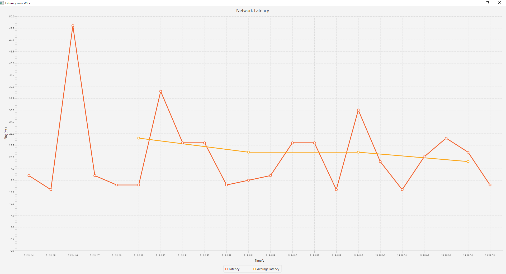

# Latency-Graph
Simple JavaFX program that graphs internet latency over time

# Background
Wanted to create a simple desktop application that graphs internet latency over time. 

# Usage
The program will automatically start to ping using the current internet connection that is present on the desktop. The red trend line represents the latency of the current packet at the current time, while the orange line represents the average latency over the last 5 packets.
